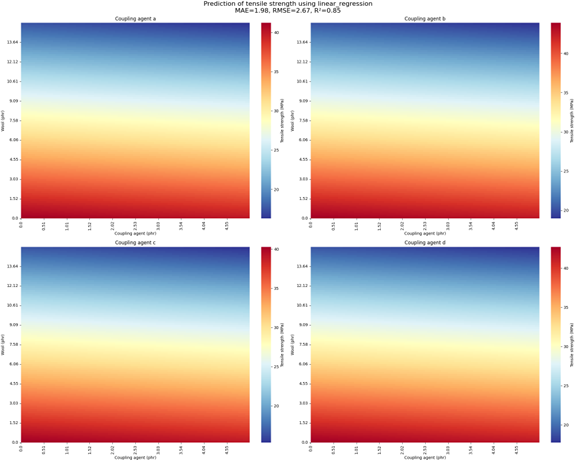
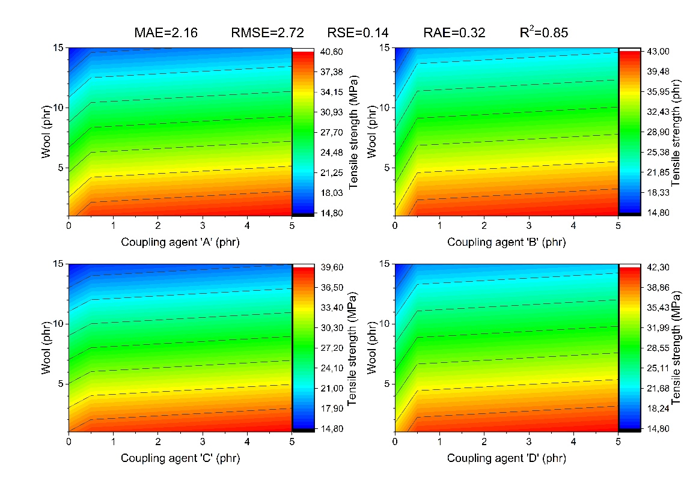
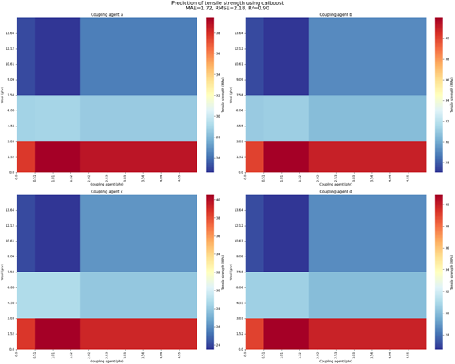
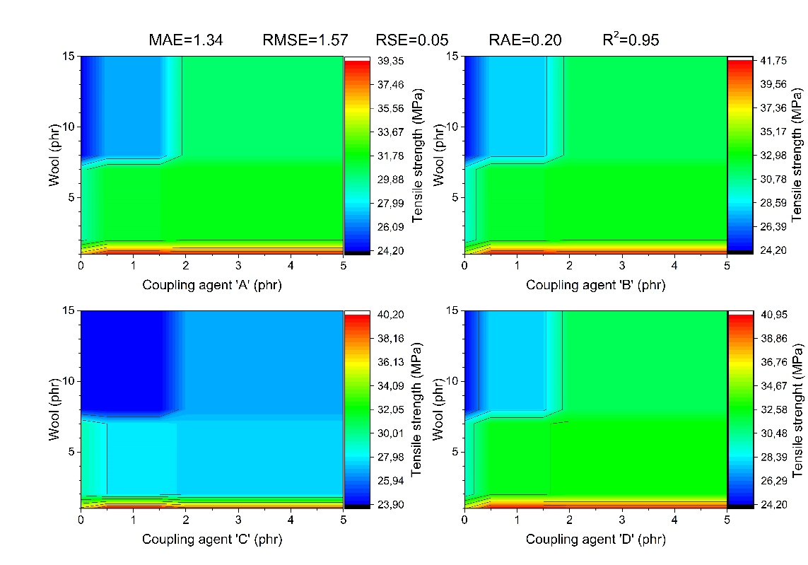

# Modelowanie predykcyjne wytrzymałości na rozciąganie kompozytów PLA wzmocnionych wełną przy użyciu bibliotek Python (eng. Predictive Modeling of Tensile Strength in Wool-Reinforced PLA Composites Using Python Libraries)

## Wstęp

Polimery wzmacniane włóknami (FRP) są nowoczesnymi materiałami zaprojektowanymi w celu osiągnięcia określonych właściwości. Wzmocnienie włóknami jest często stosowane do modyfikacji lub poprawy tworzyw sztucznych w celu spełnienia odpowiednich norm w znaczącej części zastosowań tworzyw sztucznych. W ramach tego projektu analizujemy wpływ różnych środków sprzęgających na wytrzymałość na rozciąganie kompozytów PLA przy użyciu różnych modeli regresyjnych zaimplementowanych w Pythonie. W poprzednich badaniach (przeprowadzanych przez mojego znajomego Franciszka Pawlaka z Instituto de Tecnología de Materiales Universitat Politècnica de València), analizy były przeprowadzane przy użyciu narzędzi Microsoft Azure Machine Learning Studio, które wykorzystywały algorytmy regresji liniowej i drzewa decyzyjnego do prognozowania wytrzymałości na rozciąganie. Celem niniejszego projektu jest przeprowadzenie podobnej analizy z użyciem bibliotek Python, aby zweryfikować skuteczność i porównać wyniki uzyskane różnymi narzędziami.

## Podstawowe problemy i parametry

1. Stężenie PLA: Stała wartość (100 phr).
2. Stężenie MLO (maleinowany olej lniany): Stała wartość (10 phr).
3. Stężenie wełny: Zmienna wartość (od 1 phr do 10 phr).
4. Rodzaj i stężenie środka sprzęgającego: Różne rodzaje: 
- (3-(2-aminoetyloamino)propylo)-trimetoksysilan (oznaczony jako czynnik sprzęgający A),  - trimetoksy (2-(7-oksabicyklo(4.1.0)hept-3-ylo)etylo)silan (oznaczony jako czynnik sprzęgający B),
- tris(2-metoksyetoksy)(winyl) silan (oznaczony jako czynnik sprzęgający C),
- izopropionek tytanu (IV) (trietanoloaminian) (oznaczony jako czynnik sprzęgający D) 
i zmienne stężenie środka sprzęgającego (od 0 do 2.5 phr).
5. Wytrzymałość na rozciąganie: Zmienna wartość (MPa)

## Kluczowe parametry do weryfikacji

- Wpływ ilości środka sprzęgającego na wytrzymałość na rozciąganie
- Wpływ ilości włókna na wytrzymałość na rozciąganie
- Porównanie wyników dla różnych typów środków sprzęgających

## Przygotowanie Danych

1. Wczytanie danych z pliku CSV.
2. Usunięcie brakujących wartości.
3. Konwersja typów danych na numeryczne.
4. Kodowanie zmiennych kategorycznych (typ środka sprzęgającego).
5. Podział danych na zbiór treningowy (75%) i testowy (25%).

## Analiza Danych

### Modele Regresyjne:
W projekcie zastosowano różne modele regresyjne do przewidywania wytrzymałości na rozciąganie:
- Regresja liniowa
- Gradient Boosting
- Random Forest
- SVR
- Ridge Regression
- XGBoost
- LightGBM
- CatBoost

### Metryki Ewaluacyjne:
Wyniki modeli były porównywane za pomocą następujących metryk:
- MSE (Mean Squared Error)
- MAE (Mean Absolute Error)
- RMSE (Root Mean Squared Error)
- R² (Coefficient of Determination)

# Wyniki Analizy

Tabela przedstawiająca dokładne wyniki każdego z modeli i ich metryki:
Model | MSE | MAE | RMSE | R² 
--- | --- | --- | --- |---
Linear Regression | 7.145452 | 1.980268 | 2.673098 | 0.852376
--- | --- | --- | --- |---
Gradient Boosting | 4.825482  | 1.744280 | 2.196698 | 0.900306
--- | --- | --- | --- |---
Random Forest | 4.910021 | 1.765061 | 2.215857 | 0.898560
--- | --- | --- | --- |---
SVR | 7.139248  | 1.976790 | 2.671937 | 0.852504
--- | --- | --- | --- |---
Ridge Regression | 7.061263 | 1.943935 | 2.657304 | 0.854115
--- | --- | --- | --- |---
XGBoost | 4.785061 | 1.734498 | 2.187478 | 0.901141
--- | --- | --- | --- |---
LightGBM | 4.796761 | 1.636715 | 2.190151 | 0.900900
--- | --- | --- | --- |---
CatBoost | 4.760374 | 1.720607 | 2.181828 | 0.901651

### Najlepszy model to CatBoost z najniższym RMSE (2.181828) i najwyższym R² (0.901651).

## Wizualizacja Wyników

### Heatmapa Modelu Regresji Liniowej przy użyciu bibliotek Python:

### Heatmapa Modelu Regresji Liniowej przy użyciu narzędzi Azure:

### Opis Wyników dla Modelu Regresji Liniowej:

Model regresji liniowej pokazuje ogólny trend, gdzie wzrost stężenia środków sprzęgających i redukcja stężenia włókna prowadzi do wzrostu wytrzymałości na rozciąganie. Największe poprawy zauważalne są przy niskich stężeniach środków sprzęgających (do 0,5 phr). Środki sprzęgające B i D wykazały największą skuteczność.
Możemy zauważyć niewielką różnicę w wynikach metryk jednak niższy RMSE i wyższy R² co świadczy o większej dokładności modelu wygenerowanego przez bibliotekę Python.

### Heatmapa Modelu Gradient Boosting przy użyciu bibliotek Python:

### Heatmapa Modelu Gradient Boosting przy użyciu narzędzi Azure:

### Opis Wyników dla Modelu Gradient Boosting:

Model Gradient Boosting grupuje dane w bardziej zwarte podzbiory. Wzrost stężenia środków sprzęgających przy niskim stężeniu włókna poprawia wytrzymałość na rozciąganie. Przy wyższych stężeniach włókna (powyżej 7 phr), nawet niskie stężenia środków sprzęgających poprawiają wytrzymałość na rozciąganie.
Możemy zauważyć niewielką różnicę w wynikach metryk jednak niższy RMSE i wyższy R² co świadczy o większej dokładności modelu wygenerowanego przez narzędzia Azure.

## Podsumowanie

### Najważniejsze Wnioski:
- Modele regresji liniowej i Gradient Boosting różnią się w przewidywaniach, co podkreśla różnice w sposobie uchwycenia złożonych relacji w danych.
- CatBoost okazał się najlepszym modelem z najniższym RMSE i najwyższym R², co świadczy o jego wysokiej precyzji w przewidywaniu wytrzymałości na rozciąganie.
- Niewielka różnica w wynikach metryk świadczy o większej dokładności modelu wygenerowanego przez: biblioteki Python (w przypadku regresji liniowej) oraz narzędzia Azure (w przypadku Gradient Boosting).

### Lista wykorzystanych bibliotek:
- os
- pandas (pd)
- numpy (np)
- sklearn.model_selection (train_test_split)
- sklearn.linear_model (LinearRegression, Ridge)
- sklearn.ensemble (GradientBoostingRegressor, RandomForestRegressor)
- sklearn.svm (SVR)
- sklearn.metrics (mean_squared_error, mean_absolute_error, r2_score)
- matplotlib.pyplot (plt)
- seaborn (sns)
- joblib
- google.colab (drive)
- xgboost (xgb)
- lightgbm (lgb)
- catboost (CatBoostRegressor)

### Lista wykorzystywanych baz danych/źródeł danych:
- 'db_PLA_wool_ca_mechterm v2.csv'
- https://www.mdpi.com/2073-4360/12/11/2523
- https://www.mdpi.com/2073-4360/11/9/1514
